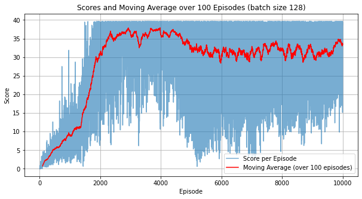

## **DRL Project Report: Continuous Control via Proximal Policy Optimization**

### **1. Introduction and Motivation:**

In reinforcement learning (RL), the tasks with continuous action spaces offer unique challenges. While DQN is adapted to operate in an environment with discrete settings (Banana Collection), using it directly in continuous spaces is inconvenient. Q-learning and its variants typically discretize action spaces, but this can lead to significant computational loads. This is due to the need to capture the intricacies of high-dimensional actions which means the agent needs to deal with an overwhelming number of possibilities.

To circumvent this issue, we can exploit policy gradient methods. These algorithms try to generate the policy itself, which contrasts with value-based strategies. They can use powerful function approximators such as neural networks to produce a distribution over potential actions, eliminating the need for extensive discretization. Therefore, policy gradient methods are ideal for challenges like Unity's "Reacher" environment, where a double-jointed arm must move fluidly to hit target points.

We choose to train our agent using the PPO algorithm, state-of-the-art in the policy gradient realm. The design of PP, which limits the policy shift,  keeps training stable, making it potentially suited for guiding the "Reacher" arm.

### **2. PPO Algorithm: An Overview**

**Proximal Policy Optimization (PPO)** Classical Policy Gradient (PG) methods can suffer from large policy updates, which lead to very unstable learning for the agent. PPO, by taking inspiration from trust region methods, addresses this issue by limiting the policy update size. Therefore, ensuring that the updates are neither too drastic nor too conservative.
PPO helps to strike a balance in agent training as it tries to achieve significant policy improvements without straying too much from the older policies.

#### **Core Mechanism:**

PPO achieves its stability and efficiency by clipping the policy update to prevent updates that could change the policy too significantly. The objective function is as follows:

$$L^{CLIP} (\theta) = \hat{E}_t [ \min (r_t(\theta) \hat{A}_t, clip(r_t(\theta), 1-\epsilon, 1+\epsilon) \hat{A}_t) ]$$

Where:
- $r_t(\theta)$ is the ratio of the probabilities under the new and old policies. The closer the value to 1, the more drastic the change.
- $\hat{A}_t$ is an estimator of the advantage function at time $t$. The Advantage measures how much better is selected action is compared to the average action given a state.

### **3. Neural Network Architecture:**
For our network architecture, we use feed-forward neural networks for both the actor and critic.
The actor decides the action to take and the citic determines its value.
#### **Shared Feature Extractor:**

- Layers: 2
- Units: 64 for each layer
- Activation: ReLU

We adopt a shared feature extractor to reduce computational. By using a common feature extractor for both actor and critic, we hope to achieve a harmonized understanding of the environment state and encourage feature reuse.

#### **Actor Network:**
- Outputs mean ($\mu$) for the action distribution (Gaussian). The mean represents the most likely action the agent should take.
- A separate learnable log standard deviation ($log\_std$) gives flexibility to the action exploration. 
- The standard deviation is kept always positive. 

#### **Critic Network:**
- Outputs state-value estimates. 
This is a crucial part of the architecture as it provides the actor with the necessary feedback for refining its policy.
  
### **4. Hyperparameter Configuration:**

A meticulously chosen hyperparameter set can heavily influence the success of PPO:

- **Learning rate**: $1e-4$
- **Discount factor** ($\gamma$): $0.99$
- **Generalized Advantage Estimation (GAE) Tau** ($\tau$): $0.95$
- **PPO epochs (n_epochs)**: $10$
- **Clipping epsilon (clip_epsilon)**: $0.2$
- **Value coefficient (value_coef)**: $0.5$
- **Entropy coefficient (entropy_coef)**: To promote exploration, set at $0.01$
- **Gradient clipping (max_norm)**: $0.5$
- **Action standard deviation bounds**: Ensures that actions don't become too deterministic or too explorative.

### **5. Performance Metrics and Benchmarks:**

#### **Evaluation:**

For Version 1 of the "Reacher" environment:
- A rolling average reward (over 100 episodes) surpassing +30 signifies a successful agent.

From the depicted figure, it's evident that our rolling average score exceeded 30 across a span of 100 episodes. The environment was solved in just **$1857$ episodes**. In particular, there were minimal dips in mean scores prior to reaching our target. After achieving a peak score of $37.9$, the average scores settled around the $30$ mark.

### **6. Future Directions and Enhancements:**
Even though we were able to solve the Reacher environment, we can still strive for better performance:
1. **Architectures**: Since we are using neural networks as function approximators to help the agent better perceive its environment, we can think of a few enhancements that could lead to a better environment understanding. For instance, we can adopt deeper architectures for enhancing the model capacity and therefore capture and model more complex patterns. Furthermore, we can use **Attention Mechanisms** to help the agent focus on the most relevant aspects of the environment for achieving the sought-after objective, for instance in our environment the agent might need to focus more on the target and disregard other less informative aspects of the environment. For environments where the temporal aspect is crucial (past states are crucial for good decision-making) we can think of using **LSTM Layers**.
2. **Regularization**: To achieve better generalization, we can use regularization techniques that prevent overfitting. We can for instance use **Dropout**, **BatchNorm**, or **LayerNorm**.
3. **Use other Contemporary methods**: We can use other methods such as **SAC, DDPG, TRPO**. Applying them to solve our environment can help identify scenarios where one algorithm might outperform the others.
4. **Curriculum Learning**: Curriculum learning helps to guide agent learning using a smooth and progressive methodology. This provides a good way to ensure that the agent is grasping the task at hand progressively and consistently. 

### **7. Conclusion:**

By using PPO to solve our "Reacher" environment, we showcased its efficiency and efficacy in handling continuous control tasks. This project serves as a foundation for deeper analyses into sophisticated DRL techniques appropriate for continuous control domains.
